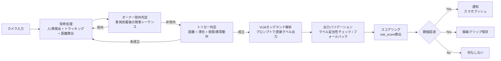

# 車両周辺セキュリティ検知ロジック仕様書

## 1. 文書情報

- 文書名: 車両周辺セキュリティ検知ロジック仕様書
- 版数: 0.2（ドラフト）
- 作成日: 2026/04/28
- 対象システム: Smart Home Security

## 2. 目的

車両周辺の不審行動を高頻度で監視しつつ、重い解析処理は必要時のみ実行することで、
低遅延・低消費リソースでの異常検知と通知を実現する。

## 3. 適用範囲

- 本仕様は、ローカル実行される車両周辺監視ロジックを対象とする。
- 対象機能は、検知、トリガー判定、行動要約、ラベル化、スコアリング、通知までとする。
- クラウド連携、通知アプリ側UI、長期分析基盤は対象外とする。

## 4. 用語定義

- 常時処理: 軽量モデルで継続実行する検知処理
- トリガー: VLM解析を起動するための条件成立イベント
- VLM: 画像または短動画から行動説明文を生成するモデル
- ラベル: 説明文を通知判定用に正規化したイベント種別
- リスクスコア: 通知要否を判定するための総合点

## 5. 全体アーキテクチャ

### 5.1 アーキテクチャ方針

- 低遅延維持のため、常時実行は軽量検知系のみとする。
- 高負荷の意味理解（VLM）はトリガー成立時のみ実行する。
- 判定と通知はローカル完結を基本とし、ネットワーク依存を最小化する。
- 車両到着直後に降車した人物はオーナー候補として扱い、誤通知を抑制する。

### 5.2 論理構成



### 5.3 コンポーネント責務

- 入力層（カメラ入力）: フレーム取得、時刻同期。
- 検知層（常時処理）: 人/車検出、追跡ID管理、人車距離算出。
- 判定層（トリガー判定）: VLM起動要否の判定。
- 除外判定層（オーナー除外）: 車両到着後の降車シーケンスを検出し、オーナー候補を除外。
- 解釈層（VLM解析）: プロンプトにラベル候補を提示し、ラベルと根拠を直接出力させる。
- バリデーション層（出力バリデーション）: VLM出力のラベル妥当性チェックと `unknown_behavior` フォールバック。
- 意思決定層（スコアリング）: リスク算出、通知判断。
- 出力層（通知/保存/ログ）: アラート配信、証跡保存、監査ログ出力。

### 5.4 データ境界

- 常時処理出力: 検出結果、トラックID、人車距離。
- VLM入力: トリガー前後クリップまたは代表フレーム列。
- VLM出力: 標準ラベルと根拠（JSON形式。ラベル候補から直接選択）。
- 判定出力: 標準ラベル、risk_score、通知実行有無。

### 5.5 ハードウェア・入力環境仕様（別章で詳細化予定）

> 本節は別章（ハードウェア仕様書）にて詳細を定義する。本仕様書では前提条件として列挙のみ行う。

- カメラ種別（RGB / IR / デュアル構成）
- カメラ解像度・入力フレームレート
- 設置位置・画角・ROI（関心領域）設定方針
- エッジデバイス仕様（CPU / GPU / NPU 構成）
- 夜間・低照度時の入力補正方針
- カメラ接続断・ハードウェア異常時の縮退動作方針

## 6. 全体処理フロー

1. 常時処理で人と車を検出し、追跡IDを付与する。
2. 車両到着後に降車した人物をオーナー候補として除外判定する。
3. 非除外対象に対して、人車距離、滞在時間、環境条件からトリガー成立を判定する。
4. トリガー成立時のみ、短い映像区間をVLMで解析する。VLMはプロンプトで提示したラベル候補から直接ラベルを選択して出力する。
5. VLM出力のラベルをバリデーションし、不正値は `unknown_behavior` へフォールバックする。
6. リスクスコアを算出し、閾値超過時に通知または録画保存する。

## 7. 機能仕様

### 7.1 常時処理（軽量・リアルタイム）

役割:
軽量推論のみを継続し、イベント候補の取りこぼしを防止する。

入力:

- カメラ映像（連続フレーム）

#### 7.1.1 推論周期

- 処理対象フレームレート: 10fps（入力フレームを間引き処理）
  - 根拠: 人の歩行速度（約1.5m/s）に対して100ms間隔で位置更新すれば追跡精度を維持できる。
- 入力フレームレートが10fps未満の場合: 全フレームを処理対象とする。
- 1フレームあたりの検出処理レイテンシ上限: 100ms（後段トリガー判定への遅延許容値から逆算）
- 処理が上限を超えた場合: 当該フレームをスキップし、次フレームを処理する（バッファ蓄積は行わない）。

#### 7.1.2 使用モデル

- 検出・トラッキングモデル: YOLOv8nを使用する。トラッキングはYOLOv8の内蔵機能（`model.track()`）を利用し、内部アルゴリズムはByteTrackを指定する。別途トラッカーの導入は不要。
- モデル切り替え方針:
  - RGB / IR 入力の切り替えに対応する場合、それぞれ専用ウェイトを用意するか、入力正規化で吸収するかは実装時に決定する。
- モデルの更新・差し替えはシステム停止なしに行えることを目標とする（詳細は実装仕様で定義）。

#### 7.1.3 検出クラスの範囲

検出対象クラスを以下の通り定義する。

| クラス | 検出対象 | 備考 |
|---|---|---|
| person | 人物全般 | 子供含む |
| vehicle | 自動車 | トリガー判定の基準車両 |

- クラス追加・除外は設定ファイルで制御し、モデル再学習なしに変更できる構成を目指す。
- 検出有効とみなす信頼度下限: 0.5（運用値として調整可）

#### 7.1.4 距離算出方法

- 算出対象: person トラックと vehicle トラックの最近傍ペア
- 算出方式: バウンディングボックス底辺中心点間のユークリッド距離をカメラ透視変換パラメータでメートル換算する。
  - 前提: カメラの設置高・俯角・画角から地面投影変換行列を事前キャリブレーションで取得済みとする。
- 精度要件: ±0.5m以内（3.0m基準距離において）
- 深度センサーを使用する場合: 別途入力仕様に従い、メートル値を直接取得してもよい。その場合も出力フォーマットは統一する。
- 距離算出不能時（検出信頼度不足など）: NaN を出力し、当該フレームのトリガー判定をスキップする。

#### 7.1.5 出力スキーマ

常時処理は以下のデータ構造を1フレームごとに後段へ渡す。

```json
{
  "frame_id": "<整数: フレーム通し番号>",
  "timestamp_ms": "<整数: エポックからのミリ秒>",
  "detections": [
    {
      "track_id": "<整数: トラッキングID>",
      "class": "<文字列: person | vehicle>",
      "bbox": [x1, y1, x2, y2],
      "confidence": "<浮動小数: 0.0-1.0>",
      "owner_excluded": "<真偽値: オーナー除外フラグ>"
    }
  ],
  "distances": [
    {
      "person_track_id": "<整数>",
      "vehicle_track_id": "<整数>",
      "distance_m": "<浮動小数 | null: メートル換算距離>"
    }
  ]
}
```

備考:

- 本段では意味理解を行わない。
- `owner_excluded` はオーナー除外判定コンポーネントが付与する。常時処理側は初期値 `false` で出力する。

### 7.2 トリガー判定

役割:
高負荷解析の不要起動を抑制し、必要ケースのみ次段へ遷移させる。

前提条件:

- オーナー除外判定で非除外と判定された人物のみ本判定へ進む。

判定条件:

- 条件A: 人が車両から3.0m以内
- 条件B: 2.0秒以上滞在（運用値2.0から3.0秒）

起動条件:

- AかつB

### 7.2.1 オーナー除外判定

役割:
車両到着後に降車した人物をオーナー候補として扱い、検知対象から除外する。

判定条件:

- 条件O1: 車両が新規に監視エリアへ進入したことを検知
- 条件O2: O1成立後、所定時間内に車両近傍（例: 1.5m以内）から人物が出現
- 条件O3: 人物トラックが車両ドア近傍から連続的に移動した軌跡を確認

除外条件:

- O1かつO2かつO3 を満たす場合、当該人物トラックを owner_candidate として除外する。

除外解除条件:

- 除外ウィンドウ経過
- 監視エリアから退出し再入場した場合
- 異常行動が継続し、手動または上位ルールで監視対象へ戻す場合

### 7.3 VLMオンデマンド解析

役割:
トリガー成立時のみ映像から行動を解釈し、**標準ラベルを直接出力**する。自由文生成は行わない。

入力:

- トリガー前後の短動画、または代表フレーム列

#### 7.3.1 プロンプト設計

VLMへのプロンプトにラベル候補一覧を明示し、ラベルと根拠を構造化形式で返させる。

```
【プロンプトテンプレート】
以下の映像を確認し、映像中の人物の行動として最も当てはまるラベルを
下記の候補から1つ選んでください。
該当なしの場合は unknown_behavior を選択してください。

ラベル候補:
- forced_entry_attempt : 窓破壊・ドア強制開錠などの不正侵入試行
- vandalism            : 車体への損傷行為（キズ・蹴り等）
- tampering            : ドア・ハンドル・鍵穴への接触・操作試行
- peering              : 車内をのぞき込む行為
- approach_fast        : 車両への急接近・走り寄り
- circling             : 車両周囲を周回する行為
- stay_near_vehicle    : 車両近傍での長時間滞在・うろつき
- unknown_behavior     : 上記いずれにも該当しない

出力形式（JSON のみ。他の文字列を含めないこと）:
{"label": "<ラベル>", "reason": "<根拠を1文で>"}
```

#### 7.3.2 出力例

```json
{"label": "tampering", "reason": "人物が車のドアハンドルを繰り返し引っ張る動作をしている"}
```

```json
{"label": "circling", "reason": "人物が車両の周囲を一定間隔で歩き回っている"}
```

#### 7.3.3 並行動作

- VLM解析は非同期で実行する。解析中も7.1（常時処理）および7.2（トリガー判定）は継続して動作する。
- VLM解析は1スレッドのみで実行する。処理中に新たなトリガーが成立した場合は、キューに積んで順次処理する。

#### 7.3.4 制約

- 常時起動は禁止する。
- タイムアウトと最大処理時間を実装側で設定する。
- プロンプトは設定ファイルで外部管理し、ラベル定義変更時は合わせて更新する。

### 7.4 出力バリデーション

役割:
VLM が出力した JSON を受け取り、ラベルの妥当性を検証する。VLM に依存したキーワード変換は行わない。

#### 7.4.1 標準ラベル一覧

7.3.1 のプロンプトと同一のラベル集合を正規値として管理する。

| ラベル | 意味 | リスク優先度 |
|---|---|---|
| `forced_entry_attempt` | 窓破壊・ドア強制開錠などの不正侵入試行 | 1（最高） |
| `vandalism` | 車体への損傷行為（キズ・蹴り等） | 2 |
| `tampering` | ドア・ハンドル・鍵穴への接触・操作試行 | 3 |
| `peering` | 車内をのぞき込む行為 | 4 |
| `approach_fast` | 車両への急接近・走り寄り | 5 |
| `circling` | 車両周囲を周回する行為 | 6 |
| `stay_near_vehicle` | 車両近傍での長時間滞在・うろつき | 7 |
| `unknown_behavior` | 上記いずれにも該当しない（フォールバック） | 8（最低） |

#### 7.4.2 バリデーションアルゴリズム

```
VLM出力 JSON
  ↓ JSONパース
    ├─ パース失敗 → is_fallback: true, label: unknown_behavior
    └─ パース成功
        ↓ label フィールドが標準ラベル一覧に含まれるか確認
          ├─ 含まれる → label をそのまま採用
          └─ 含まれない → is_fallback: true, label: unknown_behavior
  ↓ 出力スキーマに格納
```

#### 7.4.3 出力スキーマ

```json
{
  "label": "<文字列: 標準ラベル>",
  "reason": "<文字列: VLMが出力した根拠文>",
  "is_fallback": "<真偽値: unknown_behaviorにフォールバックしたか>",
  "raw_output": "<文字列: VLM生出力（デバッグ用）>"
}
```

| フィールド | 型 | 説明 |
|---|---|---|
| `label` | string | 採用された標準ラベル |
| `reason` | string | VLM が出力したラベル選択の根拠文 |
| `is_fallback` | bool | `true` の場合 `unknown_behavior` へ強制変換された |
| `raw_output` | string | VLM の生出力文字列（パース失敗時の調査用） |

#### 7.4.4 unknown_behavior の扱い

- スコアリングでは `unknown_behavior` に対して `behavior_score = 5`（最低値）を割り当て、通知閾値を超えにくくする。

### 7.5 スコアリングと通知

役割:
ローカルでリスク判定を完結し、通知要否を決定する。

#### 7.5.1 算出式

```
risk_score = behavior_score + context_score + persistence_score
```

- 各スコアの上限は以下の通り。合計の理論最大値は **100点**。

| スコア | 最小 | 最大 |
|---|---|---|
| behavior_score | 0 | 60 |
| context_score | 0 | 25 |
| persistence_score | 0 | 15 |
| **risk_score** | **0** | **100** |

#### 7.5.2 behavior_score（ラベル別固定値）

バリデーション後のラベルに対して以下の点数を割り当てる。

| ラベル | behavior_score | 根拠 |
|---|---|---|
| `forced_entry_attempt` | 60 | 即時被害に直結する行為 |
| `vandalism` | 50 | 車体損傷は実害が発生している |
| `tampering` | 45 | 解錠試行は侵入前段階として高リスク |
| `peering` | 30 | 下見・物色行為として中リスク |
| `approach_fast` | 25 | 急接近は意図不明だが警戒が必要 |
| `circling` | 15 | 周回のみでは実害に至らない |
| `stay_near_vehicle` | 10 | 滞在のみでは低リスク |
| `unknown_behavior` | 5 | 分類不能のため最小値 |

> **注意**: 上記は初期値（運用値）。実績データに基づき調整する。

#### 7.5.3 context_score（環境条件の加算）

以下の条件を独立して評価し、加算する（上限 25点）。

| 条件 | 加算点 | 判定基準 |
|---|---|---|
| 夜間帯 | +15 | 22:00〜05:59（設定ファイルで変更可） |
| 薄暮帯 | +5 | 18:00〜21:59、05:00〜06:59 |
| 過去24h以内に同エリアで不審イベントあり | +10 | ログ参照で判定 |

> 夜間帯と薄暮帯は排他。両方成立する場合は夜間帯を優先。  
> 上限 25点を超えた場合は 25点に丸める。

#### 7.5.4 persistence_score（継続性の加算）

常時処理が出力する滞在時間と反復回数から算出する（上限 15点）。

**滞在時間加算**

| 滞在時間 | 加算点 |
|---|---|
| 5秒未満 | 0 |
| 5秒以上 10秒未満 | 3 |
| 10秒以上 30秒未満 | 7 |
| 30秒以上 | 10 |

**反復回数加算**（トリガー成立後、同一トラックIDで再トリガーした回数）

| 反復回数 | 加算点 |
|---|---|
| 0回（初回のみ） | 0 |
| 1〜2回 | 3 |
| 3回以上 | 5 |

> 滞在時間加算 + 反復回数加算の合計が 15点を超えた場合は 15点に丸める。

#### 7.5.5 通知判定閾値

`risk_score` が閾値を超えた場合にクラウドへ通知する。いずれの場合もローカルに録画クリップ・ログを保存する。

| risk_score | アクション |
|---|---|
| 閾値以上 | クラウドへ通知（プッシュ通知 + 録画クリップ保存） |
| 閾値未満 | 何もしない（ログ・録画なし） |

- 閾値初期値: **70点**（運用値として調整する）
- 閾値は設定ファイルで変更可能にする。

#### 7.5.6 スコア計算例

| シナリオ | behavior | context | persistence | 合計 | アクション |
|---|---|---|---|---|---|
| 夜間・ドアへの接触試行・15秒滞在 | 45 | 15 | 7 | **67** | 何もしない |
| 夜間・ドアへの接触試行・15秒・再トリガー2回 | 45 | 15 | 10 | **70** | 通知 |
| 昼間・周回のみ・5秒 | 15 | 0 | 3 | **18** | 何もしない |
| 夜間・強制侵入試行・5秒 | 60 | 15 | 3 | **78** | 通知 |
| 夜間・分類不能・5秒未満 | 5 | 15 | 0 | **20** | 何もしない |

#### 7.5.7 出力スキーマ

```json
{
  "risk_score": "<整数: 0-100>",
  "behavior_score": "<整数>",
  "context_score": "<整数>",
  "persistence_score": "<整数>",
  "action": "<文字列: notify | discard>",
  "label": "<文字列: 根拠ラベル>",
  "reason": "<文字列: VLMが出力した根拠文>"
}
```

## 8. 非機能要件

- リアルタイム性: 常時処理は監視要件を満たす推論周期を維持すること
- リソース効率: VLMはトリガー成立時のみ実行すること
- 可用性: ネットワーク不通時もローカル判定を継続できること
- プライバシー: 判定はローカル完結を基本とすること
- 説明可能性: 通知時に根拠ラベルを保存すること

## 9. ログ要件

- 検知時刻
- 対象トラックID
- トリガー判定結果（A/B各条件）
- オーナー除外判定結果（O1/O2/O3、除外理由）
- VLM出力文
- 変換後ラベル
- リスクスコア
- 通知実行有無

## 10. 今後の確定事項

- 不自然動作判定アルゴリズムの具体式（7.2 条件C）
- VLM入力クリップ長とフレーム抽出間隔（7.3）
- オーナー除外の時間窓（到着後判定秒数、除外継続秒数）（7.2.1）
- behavior_score / 閾値の運用値調整方針（実績データ取得後）
